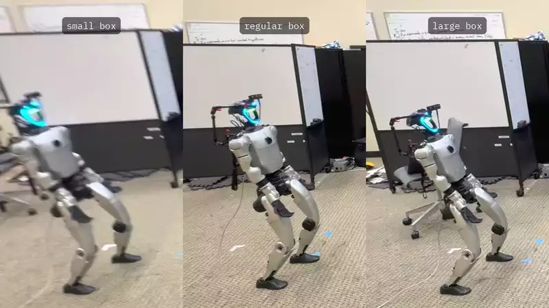
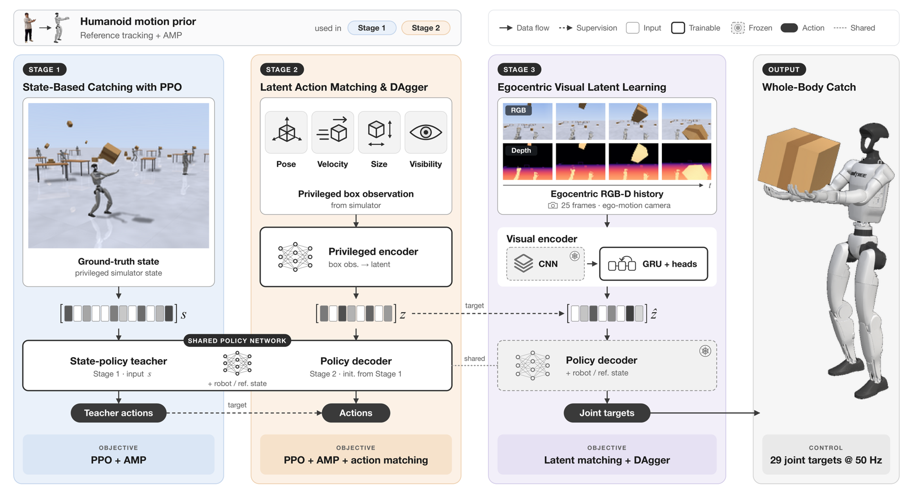

<h1 align="center"><code>Reflex</code>:<br>Visually Grounded Reactive Humanoid Control</h1>

<p align="center">
  <a href="https://toberj.github.io/humanoid-box-catch-web/static/paper/reflex.pdf"></a>
  <a href="https://toberj.github.io/humanoid-box-catch-web/"></a>
</p>

<p align="center">
  <a href="https://toberj.github.io/">Taoyang Jia</a><sup>*1,2</sup> ·
  <a href="https://weikaih04.github.io/">Weikai Huang</a><sup>*1</sup> ·
  <a href="https://linxins.net/">Linxin Song</a><sup>*3</sup> ·
  <a href="https://jareddarlington.github.io/">Jared Darlington</a><sup>1</sup> ·
  <a href="https://jyzhao.net/">Jieyu Zhao</a><sup>3</sup> ·
  <a href="https://yuewang.xyz/">Yue Wang</a><sup>3</sup> ·
  <a href="https://jiafei1224.github.io/">Jiafei Duan</a><sup>4</sup> ·
  <a href="https://jason718.github.io/">Zhongzheng Ren</a><sup>5,6</sup> ·
  <a href="https://ranjaykrishna.com/index.html">Ranjay Krishna</a><sup>1</sup>
  <br>
  <sup>1</sup>University of Washington &nbsp; <sup>2</sup>Stanford University &nbsp;
  <sup>3</sup>University of Southern California &nbsp; <sup>4</sup>National University of Singapore
  <br>
  <sup>5</sup>University of North Carolina at Chapel Hill &nbsp; <sup>6</sup>Allen Institute for AI
  <br>
  <sup>*</sup>Equal contribution
</p>

<p align="center">
  
</p>

<p align="center">
  
</p>

<br>

<h2 align="center">🚧 &nbsp;Code coming soon&nbsp; 🚧</h2>

<p align="center">
  Training and evaluation code, pretrained checkpoints and the real-robot deployment stack are being prepared for release.<br>
  <b>Watch</b> this repository to be notified. In the meantime, see the
  <a href="https://toberj.github.io/humanoid-box-catch-web/static/paper/reflex.pdf">paper</a> and the
  <a href="https://toberj.github.io/humanoid-box-catch-web/">project page</a>.
</p>

<br>

## Citation

```bibtex
@article{jia2026reflex,
  title   = {Reflex: Visually Grounded Reactive Humanoid Control},
  author  = {Jia, Taoyang and Huang, Weikai and Song, Linxin and Darlington, Jared and
             Zhao, Jieyu and Wang, Yue and Duan, Jiafei and Ren, Zhongzheng and Krishna, Ranjay},
  journal = {arXiv preprint},
  year    = {2026}
}
```
